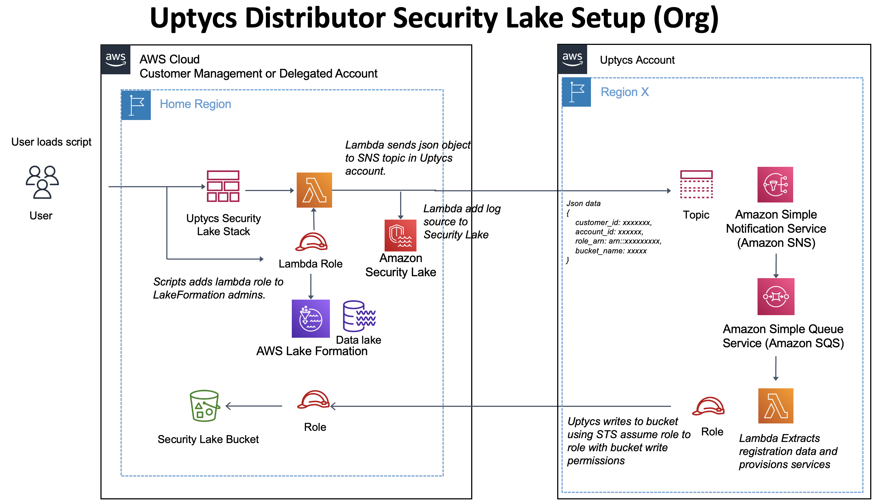

# AWS Security Lake Setup Script

The `uptycs-security-lake.py` script will create an Uptycs customized data source for security 
lake in the Security Lake delegated account. 

## Usage

```
aws-securitylake-reg % python3 uptycs-security-lake.py -h
usage: uptycs-security-lake.py [-h] -c UPTYCS_CUSTOMER_ID -d UPTYCS_DOMAIN -b STAGING_BUCKET -l SECURITY_LAKE_BUCKET [-g GLUE_ARN]

Create Uptycs Security Lake Custom log source

options:
  -h, --help            show this help message and exit
  -c UPTYCS_CUSTOMER_ID, --uptycs_customer_id UPTYCS_CUSTOMER_ID
                        REQUIRED: Your Uptycs customer customer_id
  -d UPTYCS_DOMAIN, --uptycs_domain UPTYCS_DOMAIN
                        REQUIRED: Your Uptycs customer domain
  -b STAGING_BUCKET, --staging_bucket STAGING_BUCKET
                        REQUIRED: The bucket containing the layer and cloudformation template
  -l SECURITY_LAKE_BUCKET, --security_lake_bucket SECURITY_LAKE_BUCKET
                        REQUIRED: The name of the S3 bucket created by security lake in this region. Normally aws-security-lake-xxxxxx
  -g GLUE_ARN, --glue_arn GLUE_ARN
                        REQUIRED: IAM role that permits the source to write data to the correct location in the data lake

```

## Prerequisites
You will need to provide the following information:

- Your AWS Security Lakes Delegated Admin AccountID
- The region ID where you will set up this external source
- A staging bucket in the account with the `boto3-mylayer.zip` file (Required as you will 
  require a minimum of boto3 version 1.26.112)
- IAM role that Uptycs will assume to deliver datat to your Security Lake S3 bucket. Please follow AWS's guidance on creating an IAM role that allows Security Lake to interact with custom sources:

https://docs.aws.amazon.com/security-lake/latest/userguide/custom-sources.html.

## Setup

### Clone the repo and switch to it
Open AWS cloudshell
run 
git clone https://github.com/Uptycs/aws-securitylake-reg.git
cd security-lake


### Run the Setup script
Execute the `uptycs_setup.sh` script.  The script will create and upload a boto3 layer and 
cloudformation template to a staging bucket

### Run the `uptycs-security-lake.py` Script

#### Script Overview



The script will create an Uptycs Custom log source in AWS Security Lake. 
In order to create the log source the role used to create the source must be an AWS 
LakeFormation administrator with **create table** permissions on the AWS security lake database. 

The python script creates a new role which is then added to LakeFormation with the required 
permissions.  

The script then loads a cloudformation template that creates a 
lambda function that will manage the lifecycle of the Uptycs Custom Log Source (adding or removing the log source)


